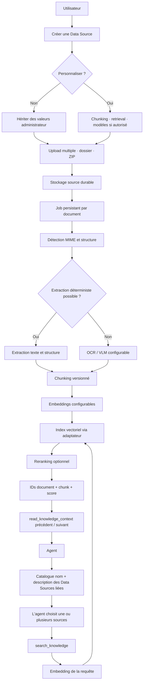

# Pipeline RAG et configuration des Data Sources

## Principes

Le parcours nominal reste volontairement court : nommer une Data Source, la
créer, puis déposer des documents. Tous les réglages techniques héritent de la
configuration administrateur. Le panneau avancé copie cette configuration et
ne crée une surcharge que si l'utilisateur choisit explicitement de
personnaliser la Data Source.

La hiérarchie de résolution est :

1. valeurs plateforme administrateur ;
2. surcharge persistée sur la Data Source ;
3. paramètres bornés de l'appel outil, uniquement pour le nombre de résultats
   demandé par l'agent.

Les réglages de chunking, candidats, résultats, score minimum et activation du
reranking relèvent de `knowledgeBases.manage`. Le changement de fournisseur,
modèle ou dimensions exige en plus `models.manage`. Cette séparation est
appliquée côté serveur ; l'interface seule n'est pas une frontière de sécurité.

## Flux cible

Le stockage source et l'index vectoriel sont deux responsabilités distinctes.
Les PDF, DOCX, CSV et archives restent dans le stockage objet pour permettre une
réextraction. PGVector est l'adaptateur initial ; Qdrant ou Chroma pourront être
ajoutés derrière le même port sans changer le contrat des outils agent.

## Invariants d'exécution

- Chaque document possède un état et un pourcentage propres ; un lot n'efface
  jamais la progression individuelle.
- PostgreSQL reste la source de vérité des jobs. BullMQ accélère le traitement,
  et le worker réconcilie les lignes `processing` après une panne ou un restart.
- Une Data Source liée ne déclenche aucune recherche automatique. Le modèle
  choisit explicitement une ou plusieurs sources à partir de leur nom et de
  leur description.
- `search_knowledge` renvoie des références bornées. Le contenu adjacent est lu
  à la demande avec `read_knowledge_context`.
- Les citations conservent `knowledgeBaseId`, `documentId`, `chunkId` et
  `chunkIndex` afin d'ouvrir le document complet et de mettre en évidence le
  passage cité.
- Les changements de modèle doivent réindexer les chunks existants. Les futurs
  changements de stratégie de chunking devront créer une nouvelle révision
  d'index à partir de la source durable, puis basculer atomiquement une fois
  cette révision prête.

## Évolutions prévues

Le prochain palier doit introduire une révision d'index immuable par Data
Source : configuration résolue, version de l'extracteur, modèle et dimensions,
statut de build, puis pointeur vers la révision active. Cela permet une
réindexation sans rendre la Data Source indisponible et évite de mélanger des
vecteurs produits avec des modèles ou dimensions incompatibles.
