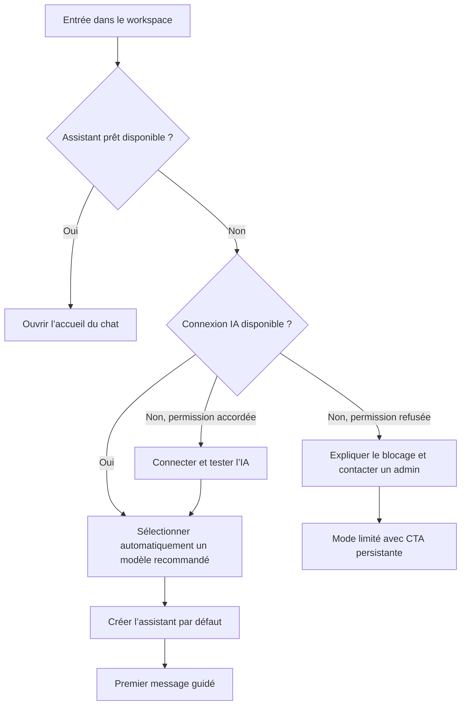
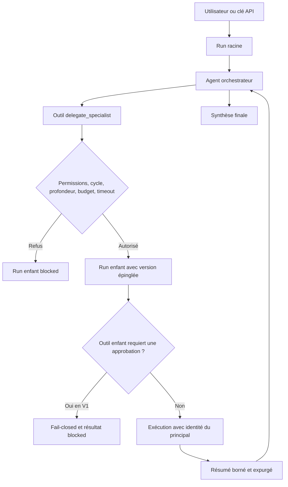

# Plan d’action — workflows utilisateurs, refonte UI/UX et agents orchestrateurs

## Statut et périmètre

- Statut : prêt pour handoff et implémentation.
- Branche : feat/ux-orchestrator-agents.
- Base auditée : main au commit 8afd251.
- Date de l’audit : 2026-07-09.
- Ce document est le seul livrable de la phase actuelle. Aucun code applicatif n’est implémenté dans ce commit.
- Ordre demandé : sécuriser et simplifier tous les parcours utilisateurs, terminer la refonte UI/UX, puis ajouter les agents orchestrateurs.
- Identité visuelle à conserver : palette blanche/bleue Deodis, police et marque existantes.

Le chantier doit être mené par lots verticaux, avec un commit cohérent et des tests ciblés pour chaque lot. Les commits verts doivent être poussés régulièrement sur la branche, sans attendre la fin du chantier.

## Sommaire

1. Résultat attendu.
2. Décisions produit et architecture.
3. Baseline déterministe.
4. Contrat d’état commun.
5. Priorités sécurité/intégrité.
6. Architecture d’information et design system.
7. Workflows utilisateurs, de l’authentification au multi-workspace.
8. Architecture des agents orchestrateurs.
9. Stratégie de tests.
10. Documentation.
11. Skills.
12. Phases et commits.
13. Gates finaux.
14. Critères de fin.
15. Hors périmètre V1.

## 1. Résultat attendu

À la fin de l’implémentation :

1. L’utilisateur comprend immédiatement quoi faire, sans devoir apprendre les notions de provider, modèle, MCP, policy ou binding avant d’utiliser le produit.
2. Chaque parcours possède un happy path court et des sorties explicites pour les états vide, chargement, erreur, permission insuffisante, conflit, annulation et reprise.
3. Une erreur de lecture ne peut jamais se transformer en écrasement silencieux lors d’une sauvegarde.
4. Chaque page propose une seule action primaire ; les actions rares ou techniques sont secondaires, contextuelles ou rangées sous Avancé.
5. La navigation ne présente plus chaque objet technique comme une destination de premier niveau.
6. Les interfaces FR et EN sont complètes et conservent la route, les paramètres, le hash et le contexte actif lors d’un changement de langue.
7. L’application est utilisable au clavier, au lecteur d’écran et sur mobile, avec des états de focus, des cibles tactiles et des annonces dynamiques cohérents.
8. Un utilisateur autorisé peut créer un agent de type Orchestrateur, lui affecter des agents spécialistes, tester sa configuration et suivre les délégations dans le chat.
9. Une orchestration ne peut ni créer de boucle, ni dépasser ses budgets, ni contourner les permissions, quotas, approbations ou règles d’audit.
10. La codebase, les décisions d’architecture, les parcours, les tests, le runbook et les skills sont documentés et vérifiés en CI.

## 2. Décisions produit et architecture déjà prises

Ces décisions évitent au prochain modèle de repartir dans une phase de découverte.

### 2.1 Expérience générale

- Ne pas ajouter un dashboard générique supplémentaire. Le chat reste le point d’entrée et son état d’accueil devient le centre de démarrage du workspace.
- Conserver une interface calme, utilitaire et raffinée : hiérarchie claire, espace, surfaces sobres, azur Deodis réservé aux actions et statuts utiles.
- Une page possède un seul titre principal visible et une seule action primaire.
- Les statistiques ne précèdent plus l’action principale ; elles sont affichées seulement lorsqu’elles aident une décision.
- Les guides permanents disparaissent après le premier succès et restent accessibles dans une aide contextuelle.
- Les formulaires affichent d’abord les choix métier ; identifiants, headers, paramètres moteur et politiques restent sous Avancé.
- Les actions destructrices utilisent une confirmation décrivant l’impact ou un mécanisme d’annulation.

### 2.2 Navigation cible

La navigation est organisée par intention :

- Principal : Chat, Assistants, Connaissances, Automatisations.
- Capacités : Outils, avec les sous-onglets Intégrés, Connexions/MCP, Skills, Outils personnalisés et Approbations.
- Découverte : Marketplace.
- Paramètres : Compte, Connexions IA, Clés API.
- Administration, uniquement selon les permissions : Équipe, Usage, Journal, Gouvernance, Santé.

Les routes historiques restent compatibles pendant la migration, mais ne restent pas toutes visibles dans la sidebar :

- /custom-tools devient un sous-parcours de /tools.
- /mcp devient un deep link ou une redirection vers l’onglet Connexions de /tools.
- /api-keys devient l’onglet Développeur ou Clés API des paramètres.
- /admin/settings est découpé en sous-sections de paramètres plateforme.
- Approbations reste contextuel dans le chat et le hub Outils, avec badge uniquement lorsqu’une action est requise.

Le groupe avancé s’ouvre automatiquement lorsqu’une de ses routes est active et mémorise le choix de l’utilisateur.

### 2.3 Agents orchestrateurs V1

- Ajouter un type d’agent explicite : assistant ou orchestrator.
- Le type est choisi à la création et reste stable en V1.
- Les délégations sont versionnées et épinglent une version précise de l’agent enfant pour rendre les exécutions reproductibles.
- Les agents enfants appartiennent au même workspace en V1.
- La publication Marketplace d’un orchestrateur est désactivée en V1 avec une explication claire ; le packaging récursif est hors périmètre.
- Les outils enfants demandant une approbation humaine sont fail-closed en V1. La reprise durable d’un sous-agent après approbation sera une V2.
- L’identité et les permissions du principal initiateur sont propagées ; l’identité du créateur de l’enfant n’est jamais utilisée.
- Chaque run est persistant, hiérarchique, chiffré, annulable et mesuré.

## 3. Baseline à restaurer avant tout diagnostic de code

L’environnement local audité est désynchronisé :

- package-lock.json cible AI SDK 7.0.4, mais node_modules contient AI SDK 5.0.192.
- npm local est 11.10.0, alors que le projet exige 11.18.0.
- Plusieurs dépendances du lock sont absentes, dont next-intl, jszip, Prettier, la couverture Vitest, plusieurs packages AI SDK, Tiptap et Streamdown.
- .next contient des types générés obsolètes.

Conséquences du baseline actuel :

- lint : vert ;
- typecheck : 143 erreurs dans 57 fichiers ;
- tests : 695 passés, 5 échoués, 20 ignorés, avec 12 suites affectées par des dépendances absentes ;
- build : échec sur next-intl/plugin ;
- couverture : dépendance absente ;
- format : Prettier absent ;
- 104 tests Playwright collectés, non exécutés pendant l’audit read-only.

Ce baseline ne prouve pas que le code est défectueux. La première étape de l’implémentation est donc :

1. installer npm 11.18.0 ;
2. supprimer uniquement les artefacts générés .next ;
3. exécuter npm ci avec le lock existant ;
4. vérifier npm ls et npm run lockfile:check ;
5. relancer format, lint, typecheck, tests, couverture et build ;
6. consigner uniquement les erreurs encore reproductibles après cette remise à zéro.

Ne modifier ni package.json ni package-lock.json pour contourner un node_modules ancien.

### Méthode et limite de l’audit

L’audit a croisé le code des pages, composants, routes et use cases, les dictionnaires FR/EN, les tests existants, les documents produit et la documentation courante Next.js/AI SDK. Aucun navigateur applicatif complet n’était disponible pendant cette phase read-only. Les contrastes réels, la densité perçue, les gestes tactiles et le responsive doivent donc être confirmés par captures et tests manuels après la remise à zéro de l’environnement.

La base existante possède déjà de bons éléments à conserver : WorkspacePage expose un vrai h1, les focus globaux sont visibles, prefers-reduced-motion est géré et les dictionnaires FR/EN possèdent les mêmes clés. Le chantier doit consolider cette base, pas reconstruire chaque primitive.

## 4. Contrat d’état obligatoire pour chaque parcours

Chaque vue qui dépend du serveur doit distinguer explicitement les états suivants :

| État           | Comportement attendu                                                                                                                                                                                                              |
| -------------- | --------------------------------------------------------------------------------------------------------------------------------------------------------------------------------------------------------------------------------- |
| Initialisation | Skeleton ou progression bornée, aria-busy et texte localisé.                                                                                                                                                                      |
| Prêt           | Contenu utile en premier, une action primaire.                                                                                                                                                                                    |
| Vide           | État vide uniquement après une réponse réussie ; explication et prochaine action.                                                                                                                                                 |
| Partiel        | Les sections disponibles restent lisibles ; les mutations dépendant d’une section en échec sont bloquées.                                                                                                                         |
| Erreur         | Erreur inline, cause utile, Réessayer et retour sûr ; le toast reste secondaire.                                                                                                                                                  |
| Interdit       | Message explicite, permission manquante et action possible selon le rôle.                                                                                                                                                         |
| Conflit        | Comparaison avec la version actuelle, rechargement ou nouvelle tentative ; aucune perte silencieuse.                                                                                                                              |
| Hors ligne     | Brouillons et données locales préservés ; reprise lorsque le réseau revient.                                                                                                                                                      |
| Mutation       | Bouton busy, double clic impossible, idempotence côté serveur.                                                                                                                                                                    |
| Succès         | Confirmation courte, navigation prévisible et prochaine action.                                                                                                                                                                   |
| Annulation     | Arrêter tout nouveau travail et marquer l’état de façon fiable. Un effet externe déjà terminé ne peut pas être annulé : il doit être signalé, idempotent si le fournisseur le permet, ou accompagné d’une compensation explicite. |
| Destruction    | Impact et dépendances affichés, confirmation ou undo.                                                                                                                                                                             |

Cette grille est appliquée à toutes les routes, y compris les écrans admin. Une liste vide ne doit jamais servir de valeur de repli après une erreur GET.

## 5. Priorités de sécurité et d’intégrité avant le redesign

### P0.1 Sauvegarde atomique des capacités d’un agent

Constat :

- src/app/[locale]/(workspace)/agents/[agentId]/page.tsx transforme l’échec de chargement des bindings outils, connaissances ou skills en tableau vide.
- La sauvegarde envoie ensuite trois PUT parallèles.
- Chaque PUT crée et active une version différente.
- Les bindings sont clonés ou écrits hors transaction et le verrou actuel est seulement mémoire/process.

Risque utilisateur : une erreur réseau ou deux sauvegardes concurrentes peuvent supprimer des capacités existantes, produire des versions partielles ou perdre une modification.

Action :

- Bloquer toute sauvegarde lorsqu’une source requise n’a pas chargé.
- Afficher la section indisponible avec Réessayer.
- Créer une commande atomique avec baseVersionId.
- Prendre un verrou PostgreSQL, vérifier la version de base, créer exactement une version et tous ses bindings dans une transaction, puis activer la version.
- Retourner 409 si une autre sauvegarde a gagné la course.
- Ne plus créer de version pour un simple changement de nom, description ou logo.

### P0.2 Rattachement d’une base de connaissances

Constat : si le GET des bindings échoue dans la page Knowledge, l’UI envoie uniquement la nouvelle base et peut effacer les rattachements existants.

Action :

- GET en échec = aucune mutation autorisée.
- Partager le même composant et la même commande atomique entre Knowledge et l’éditeur d’agent.
- Permettre attacher, détacher et inspecter les rattachements courants.

### P0.3 Suppression du transfert de secrets Marketplace

Constat : includeSecrets peut inclure des credentials chiffrés dans un manifeste public et les recréer chez l’installateur.

Décision :

- Supprimer le transfert de valeurs secrètes de tous les manifests Marketplace, publics comme privés.
- Ne publier que le schéma des credentials attendus.
- À l’installation, exécuter un preflight puis demander à l’installateur de fournir ses propres connexions.
- Redacter les versions déjà publiées, identifier les éléments concernés et documenter la rotation des secrets.
- Retirer le contrôle UI includeSecrets et les champs de manifest associés.
- Conserver une visibilité privée par défaut.

### P0.4 Approbations explicites et idempotentes

Constat :

- L’API retourne les arguments d’un outil, mais l’écran d’approbation ne les affiche pas.
- Deux approbations concurrentes peuvent exécuter deux fois une action à effet de bord.

Action :

- Afficher cible, arguments expurgés, effet attendu, niveau de risque et données masquées.
- Utiliser une transition atomique awaiting_approval vers running/executing avant l’exécution.
- Ajouter une clé d’idempotence et un statut terminal fiable.
- Renforcer la confirmation des actions critiques.
- Prévoir recovery et visibilité en cas d’exécution partielle.

### P0.5 Preview et installation de skill

Constat : une commande peut être modifiée après Preview sans invalider la preview ; l’installation directe sans preview reste possible.

Action :

- Invalider la preview au premier changement.
- Calculer et vérifier un checksum de la commande/source prévisualisée.
- Exiger preview puis confirmation des fichiers, de la portée et de la source.
- Avant suppression, afficher les assistants impactés et demander confirmation.

## 6. Architecture d’information et suppressions

### 6.1 Ce qui doit disparaître ou être déplacé

| Avant                                                    | Après                                                                             |
| -------------------------------------------------------- | --------------------------------------------------------------------------------- |
| Jusqu’à 14 destinations de premier niveau                | Destinations regroupées par intention, administration selon permissions.          |
| Titre dans le shell puis second titre dans WorkspacePage | Un seul h1 de page ; shell compact pour navigation et contexte.                   |
| Bouton global Retour au chat sur toutes les pages        | Chat accessible par navigation ; action contextuelle uniquement lorsqu’elle aide. |
| /custom-tools et /mcp comme destinations séparées        | Sous-onglets du hub Outils.                                                       |
| Approbations comme contenu permanent                     | Badge et inbox contextuelle lorsqu’une action est requise.                        |
| Guides, heroes et statistiques permanents                | Guide uniquement au premier usage ou dans l’aide ; action utile en premier.       |
| Plusieurs CTA de même poids                              | Une CTA primaire, le reste en secondaire ou menu.                                 |
| Réglages moteur visibles dès l’entrée                    | Parcours Basic puis Avancé.                                                       |
| Plusieurs boutons de sauvegarde d’un agent               | Une barre Enregistrer et valider, transactionnelle et sensible au dirty state.    |
| Erreur transformée en empty state                        | État erreur distinct, inline et récupérable.                                      |
| Suppression immédiate ou native confirm                  | Dialog d’impact ou undo.                                                          |
| Actions uniquement au hover                              | Actions accessibles au focus, clavier et tactile.                                 |
| Copies FR/EN codées en dur                               | Dictionnaires complets et vérification automatique.                               |

Inventaire de décision par surface :

| Surface actuelle              | Décision                                              | Automatisation ou progressive disclosure                                                          |
| ----------------------------- | ----------------------------------------------------- | ------------------------------------------------------------------------------------------------- |
| /chat                         | Conserver et recentrer                                | Sélectionner l’assistant sain par défaut, reprendre le contexte sûr et guider le premier message. |
| /agents                       | Conserver et simplifier                               | Générer le slug, pré-sélectionner le modèle recommandé et masquer les filtres à faible volume.    |
| /agents/:id                   | Conserver, découper Basic/Capacités/Délégation/Avancé | Calculer la readiness et prévenir les conflits de version.                                        |
| /knowledge                    | Conserver et simplifier                               | Upload multi-fichier, rattachements partagés avec l’éditeur d’agent.                              |
| /scheduled-tasks              | Conserver sous le nom Automatisations                 | Détecter le fuseau, proposer des presets et calculer la prochaine exécution réelle.               |
| /tools                        | Conserver comme hub                                   | Charger indépendamment Intégrés, Connexions, Skills, Custom Tools et Approbations.                |
| /custom-tools                 | Fusionner puis redirect                               | Ouvrir l’onglet Outils personnalisés.                                                             |
| /mcp                          | Fusionner puis redirect                               | Ouvrir l’onglet Connexions/MCP.                                                                   |
| /marketplace                  | Conserver et simplifier                               | Preflight dépendances/credentials avant installation.                                             |
| /providers                    | Déplacer sous Paramètres > Connexions IA              | Choisir un preset et découvrir/tester les modèles automatiquement.                                |
| /api-keys                     | Déplacer sous Paramètres > Clés API                   | Scopes et expiration proposés avant la création.                                                  |
| /members                      | Réaffecter à la vraie Équipe workspace                | Invitations, membres et rôles du workspace.                                                       |
| /settings                     | Conserver comme hub Compte/Workspace                  | Dirty state, sous-routes et permissions explicites.                                               |
| /admin/settings               | Découper sous Administration plateforme               | Gouvernance, inscription, navigation, automations admin et santé.                                 |
| /usage et /audit              | Conserver sous Administration                         | Filtres cohérents, agrégats serveur, pagination et export complet.                                |
| Sélecteur de workspace absent | Ajouter au shell                                      | Restaurer le dernier workspace et isoler toutes les données/conversations.                        |

### 6.2 Design system cible

Consolider les composants existants au lieu d’ajouter des variantes par page :

- WorkspacePage : largeur, h1, description, action primaire et slots cohérents.
- PageState : loading, error, forbidden et retry.
- GuidedEmptyState : contexte, première action, aide secondaire.
- ResourceCard : identité, statut, résumé, action principale et menu.
- StatusBadge : états normalisés, texte et icône en plus de la couleur.
- ReadinessChecklist : visible seulement tant que le workflow est incomplet.
- ConfigurationSection : Basic/Advanced avec dirty state et erreurs de section.
- SaveBar : état modifié, sauvegarde, annulation et conflit de version.
- ActionInbox : approbations et réparations requises.
- AttachmentProgress et UploadQueue : progression, retry, annulation.
- DelegationTrace : arbre expurgé des runs orchestrés.

Règles de finition :

- rayons concentriques entre surfaces imbriquées ;
- ombres légères et sémantiques, pas de bordures lourdes partout ;
- headings équilibrés et textes longs lisibles ;
- chiffres dynamiques en tabular-nums ;
- cibles interactives recommandées à 44 px, jamais sous le minimum WCAG 24 px ;
- scale 0.96 au press seulement lorsque pertinent ;
- transitions limitées à des propriétés explicites ;
- reduced motion respecté ;
- focus visible et non masqué ;
- mobile sans overflow horizontal à 320 px.

Avant d’ajouter ou modifier une primitive shadcn, consulter les docs correspondant à la version installée et réutiliser les composants déjà présents.

## 7. Plan par workflow utilisateur

### 7.1 Authentification et session

Scénarios :

- inscription ouverte, fermée ou premier compte ;
- connexion valide, invalide, compte suspendu et session expirée ;
- champs vides, mot de passe oublié et retour à la route initiale ;
- utilisateur déjà connecté ouvrant une route auth ;
- FR/EN et navigation clavier.

Actions :

- Résoudre l’état d’inscription côté serveur avant d’afficher le formulaire.
- Localiser les pages, erreurs, logout, 404 et fallback global.
- Ajouter mot de passe oublié/réinitialisation si le backend le permet ; sinon documenter explicitement le non-support.
- Conserver la destination initiale après authentification.
- Associer chaque erreur au champ concerné et focaliser la première erreur.
- Ne jamais perdre la query ou le hash lors du changement de langue.

### 7.2 Premier accès et onboarding

Scénarios :

- aucun provider et utilisateur autorisé à en créer un ;
- aucun provider et utilisateur sans permission ;
- provider existant sans modèle ;
- modèle existant sans assistant prêt ;
- configuration partielle reprise après interruption ;
- test provider en échec ;
- mode limité volontaire ;
- erreur du POST final.

Parcours cible :

Actions :

- Parcours reprenable Connexion IA → Modèle recommandé → Assistant → Chat.
- Ne pas enregistrer un provider comme Connecté avant un test réussi.
- Permettre Enregistrer comme brouillon si le test échoue.
- Masquer les champs techniques sous Avancé.
- Vérifier la réponse du POST final avant le succès et la redirection.
- Rendre le mode limité explicite, récupérable et visible dans le chat.
- Éviter tout flicker ou saut d’étape après le premier rendu.

### 7.3 Navigation et shell

Scénarios :

- utilisateur standard, workspace admin et platform admin ;
- permissions en chargement, refusées ou indisponibles ;
- sidebar large, réduite et mobile ;
- route avancée ouverte directement ;
- retour navigateur et deep link.

Actions :

- Ne pas masquer silencieusement toute la navigation lorsqu’une requête de permissions échoue.
- Afficher un état explicite et un retry.
- Ouvrir le groupe avancé si sa route est active.
- Préserver le choix réduit/étendu et la largeur.
- Supprimer le double landmark main du chat.
- Conserver path, query et hash à travers locale et navigation.

### 7.4 Chat

Scénarios :

- aucun assistant, assistant incomplet ou provider défaillant ;
- nouvelle conversation, conversation existante et reprise ;
- changement d’assistant avec conversation en cours ;
- réponse en streaming, stop, retry, resend et erreur réseau ;
- message mis en file, pièce jointe, image collée et workspace ZIP ;
- quota atteint, approval requis et outil refusé ;
- sidebar vide, volumineuse, recherche, DnD et alternative clavier ;
- mobile, IME, lecteur d’écran et contenu très long.

Actions :

- Transformer l’état vide du chat en accueil utile : continuer, créer un assistant, connecter l’IA, ajouter des connaissances.
- Sélectionner automatiquement l’assistant par défaut prêt.
- Changer d’assistant crée une nouvelle conversation ou demande une confirmation ; ne jamais mélanger les contextes.
- Conserver brouillon, fichiers et message en queue jusqu’à la confirmation d’envoi.
- En cas d’échec, proposer Réessayer, Modifier ou Annuler sans perte.
- Faire défiler le premier chargement vers le dernier message, sauf ancre explicitement sauvegardée.
- Ajouter recherche de conversations.
- Rendre les actions visibles avec focus-within, pas uniquement au hover.
- Ajouter une alternative clavier aux réordonnancements.
- Gérer event.isComposing pour Enter et préserver le texte lors du collage d’image.
- Utiliser role=log et annoncer les états de génération sans bruit excessif.
- Afficher un contexte compact Agent · modèle · capacités, repliable sur mobile.

### 7.5 Liste et création d’assistants

Scénarios :

- aucun assistant, un assistant ou beaucoup d’assistants ;
- assistant prêt, incomplet, provider malsain, read-only ou archivé ;
- création standard, template, orchestrateur et conflit de slug ;
- duplication, partage, suppression et permission insuffisante.

Actions :

- Une seule CTA Nouvel assistant.
- Retirer le guide permanent dès le premier assistant.
- Carte avec type, santé réelle, modèle, capacités, action Chat et menu secondaire.
- N’afficher recherche/filters que lorsque le volume le justifie ; stocker les filtres dans l’URL.
- Création courte : type, nom/mission, modèle recommandé. Slug automatique.
- Si aucun modèle n’est prêt, guider vers Connexions IA puis revenir au draft.
- Read-only doit permettre l’inspection complète ; seule la mutation est bloquée.
- Mutations busy par ligne et actions de navigation rendues comme liens.

### 7.6 Configuration d’un assistant

Scénarios :

- chargement complet, section partielle en échec et version devenue obsolète ;
- Basic, Capacités, Délégation pour orchestrateur et Avancé ;
- modifications non enregistrées, retour navigateur, conflit 409 ;
- version read-only et clone-to-edit.

Actions :

- Basic : identité, modèle, instructions, suggestions et Test dans le chat.
- Capacités : outils, connaissances et skills.
- Délégation : seulement pour orchestrateur.
- Avancé : paramètres de génération, mémoire, guardrails et policies.
- Onglet dans l’URL et garde de navigation pour dirty state.
- Une seule sauvegarde transactionnelle.
- Santé Ready basée sur provider/model réellement disponibles, pas seulement deux IDs.
- Erreur par section ; aucune valeur vide inventée après un GET en échec.

### 7.7 Outils, MCP, skills et outils personnalisés

Scénarios :

- permissions en chargement, catalogue vide ou indisponible ;
- outil intégré, connexion externe, skill et custom tool ;
- credentials absents/expirés ;
- approval pending, history, rejet et retry ;
- MCP local/stdio en environnement incompatible ;
- builder avant/après confirmation.

Actions :

- Unifier les destinations dans le hub Outils.
- Remplacer le hero et les statistiques statiques par l’action utile.
- Présenter Tools comme capacités, Connexions comme services externes et Approbations comme décisions de sécurité.
- Charger les onglets indépendamment ; une erreur n’efface pas les autres.
- Verrouiller les toggles pendant une mutation.
- Détecter et expliquer les transports incompatibles.
- Pour le builder : conversation de clarification, puis écran Vérifier et créer listant side effects, secrets, portée et activation.
- Séparer création et activation.
- Afficher expiration et état des credentials.
- Ne jamais tronquer une liste sans Voir tout et ne pas double-compter les outils.

#### MCP et connexions

Scénarios :

- créer, éditer, tester, synchroniser, désactiver et supprimer un serveur ;
- changer de transport et invalider les champs incompatibles ;
- credentials manquants, invalides ou expirés ;
- stdio/local indisponible dans le déploiement ;
- découverte d’outils partielle ;
- suppression du serveur réussie mais nettoyage distant ou bindings en échec.

Actions :

- Valider le transport avant la sauvegarde et afficher les capacités de l’environnement.
- Tester la connexion sans perdre le formulaire.
- Afficher les outils découverts, les erreurs par outil et une action Resynchroniser.
- Montrer les assistants impactés avant désactivation/suppression.
- Rendre le nettoyage idempotent et récupérable.

#### Skills

Scénarios :

- preview, installation, création/édition manuelle et suppression ;
- commande, frontmatter, nom ou chemin invalide ;
- portée privée ou globale ;
- fermeture avec modifications non enregistrées ;
- skill lié à plusieurs assistants ;
- source changée entre preview et confirmation.

Actions :

- Exiger preview/checksum pour une source externe.
- Valider frontmatter et structure avant sauvegarde.
- Ajouter dirty state et garde de fermeture.
- Expliquer la portée et les assistants consommateurs.
- Confirmer la suppression avec son impact.

#### Outils personnalisés

Scénarios :

- clarification, preview, création, activation et exécution ;
- secrets requis, invalides ou expirés ;
- workflow distant créé mais enregistrement local en échec, et inversement ;
- suppression locale avec workflow distant présent ;
- permission ou provider du builder indisponible.

Actions :

- Ne créer aucun workflow avant l’écran Vérifier et créer.
- Séparer création, stockage des secrets et activation.
- Montrer les effets de bord et la portée.
- Persister un état de compensation/recovery pour les créations ou suppressions partielles.
- Permettre de réessayer chaque étape sans dupliquer le workflow.

#### Approbations

Scénarios :

- pending_approval et ancien statut awaiting_approval ;
- action déjà approuvée, rejetée, expirée ou exécutée par une autre session ;
- arguments sensibles à expurger ;
- exécution partielle ou erreur après claim ;
- retry, historique et accès sans permission.

Actions :

- Normaliser les statuts côté domaine et UI.
- Afficher le contenu expurgé avant décision.
- Claim atomique, idempotence et message clair si une autre session a traité l’action.
- Historique consultable sans rendre de nouveau les actions terminales cliquables.

### 7.8 Connaissances

Scénarios :

- aucune base, base vide, documents en traitement, indexés ou échoués ;
- upload simple, multiple, type invalide, fichier trop gros, retry et annulation ;
- changement rapide de base ;
- recherche vide ou erreur ;
- attach/detach à plusieurs assistants.

Actions :

- Guide uniquement à l’état vide.
- Dropzone avec bouton de sélection, multi-fichier, types/taille, progression et retry.
- Parsing côté serveur ; ne pas utiliser File.text sur un fichier arbitraire.
- Annuler ou ignorer toute réponse obsolète après changement de base.
- Polling borné avec état bloqué et diagnostic.
- Empty states distincts pour documents et recherche.
- Gestion complète des rattachements dans un composant partagé.

### 7.9 Connexions IA et modèles

Scénarios :

- aucun provider, provider en brouillon, sain ou défaillant ;
- changement rapide de provider ;
- découverte de modèles vide, lente ou en erreur ;
- preset connu et endpoint OpenAI-compatible personnalisé ;
- permission de lecture sans permission de gestion.

Actions :

- Choisir d’abord un preset fournisseur.
- Afficher uniquement les champs pertinents ; headers/query sous Avancé.
- Exiger les données nécessaires au preset.
- AbortController ou request token pour ignorer les réponses hors ordre.
- Ne marquer Connecté qu’après un test réussi.
- Permettre brouillon et réparation guidée.
- Après refresh, sélectionner un provider encore présent ou aucun.

### 7.10 Marketplace

Scénarios :

- collections chargées indépendamment ;
- recherche sans résultat ;
- installation prête ou dépendances manquantes ;
- double clic, erreur partielle et retry ;
- publication, partage nominatif et permission non-admin ;
- credentials requis ;
- item orchestrateur.

Actions :

- Charger chaque collection indépendamment.
- Persister onglets et filtres dans l’URL.
- Preflight avant mutation : provider, modèle, outils, credentials, permissions et compatibilité.
- Installation idempotente et busy.
- Publication atomique, sans brouillon orphelin.
- Endpoint de recherche de destinataires scoped au workspace ; ne pas utiliser une route admin globale.
- Récapitulatif avant et après installation.
- Orchestrateur non publiable en V1, motif explicite.

#### Modération Marketplace

Scénarios :

- item en attente, publié, mis en avant, suspendu, archivé ou restauré ;
- feature/unfeature concurrent ;
- modérateur sans permission ;
- action déjà traitée ;
- erreur après mutation partielle.

Actions :

- Séparer clairement les actions propriétaire et modérateur.
- Demander confirmation avec motif pour suspendre/archiver.
- Rendre feature, suspension et restauration idempotentes avec busy par item.
- Conserver l’audit, l’auteur, le motif et l’état précédent.
- Afficher un recovery explicite en cas de conflit ou d’état déjà modifié.

### 7.11 Automatisations et tâches planifiées

Scénarios :

- aucune tâche, création, édition, suppression, run now et historique ;
- timezone, prochaine exécution et assistant indisponible ;
- toggle concurrent ;
- orchestrateur et action qui requerrait une approbation.

Actions :

- Liste en premier, CTA Planifier ; formulaire en dialog ou drawer.
- Presets et prompts localisés.
- Résumé naturel incluant le fuseau.
- Édition, Exécuter maintenant et historique.
- Trier sur la vraie prochaine exécution.
- Toggle busy et suppression confirmée/annulable.
- Réparation guidée si l’assistant est supprimé ou incomplet.
- Utiliser le même runtime et les mêmes policies que le chat.
- En exécution headless V1, toute approval enfant requise bloque proprement le run.

### 7.12 Compte, équipe, clés API et administration

Scénarios :

- compte personnel ;
- membre workspace, workspace admin et platform admin ;
- invitation, changement de rôle et protections sur soi-même ;
- clé API créée, copiée, expirée ou révoquée ;
- settings modifiés, annulés ou en conflit ;
- usage/audit avec pagination et export.

Actions :

- Séparer Compte, Équipe workspace et Administration plateforme.
- Ne plus appeler Équipe une page qui gère uniquement les comptes plateforme.
- Décision ferme : /members devient la vraie page Équipe workspace en s’appuyant sur workspaceMembers, workspaceInvitations et les rôles existants. La gestion des comptes plateforme est déplacée sous Administration.
- Désactiver en UI les actions que le backend refusera sur l’utilisateur courant.
- Découper la longue page admin en sous-sections.
- Ajouter dirty state et revert.
- Clés API avec scopes, expiration, secret one-shot et bouton J’ai copié.
- Confirmation avant revoke et erreurs réseau inline.
- Pour Usage/Audit, choisir soit application automatique avec debounce, soit bouton Appliquer, jamais les deux.
- Agrégats serveur exacts, pagination et export complet ; ne pas présenter 100 lignes comme des totaux globaux.

#### Compte et sécurité personnelle

Scénarios :

- changement de mot de passe réussi, mot de passe actuel invalide et compte sans credential password ;
- révocation des autres sessions ;
- changement de langue avec formulaire dirty ;
- session expirée pendant la mutation.

Actions :

- Expliquer les méthodes de connexion disponibles.
- Valider et afficher les erreurs au bon champ.
- Ajouter révocation des autres sessions avec confirmation.
- Re-authentifier lorsque l’opération sensible l’exige.

#### Équipe workspace

Scénarios :

- liste vide hors membre courant ;
- invitation créée, renvoyée, expirée, acceptée ou annulée ;
- ajout d’un utilisateur existant ;
- changement de rôle ;
- retrait d’un membre ;
- protection du dernier owner et de l’utilisateur courant ;
- permission insuffisante.

Actions :

- Afficher membres et invitations dans des sections distinctes.
- Rendre les rôles compréhensibles avant confirmation.
- Expliquer les actions impossibles plutôt que laisser le backend les refuser.
- Conserver audit, busy/idempotence et recovery.

#### Comptes et administration plateforme

Scénarios :

- inscriptions ouvertes/fermées ;
- création, suspension, réactivation et changement de rôle d’un compte plateforme ;
- tentative d’auto-suspension ou retrait du dernier admin ;
- gouvernance des assistants ;
- configuration de navigation ;
- chat automation ;
- custom tool builder admin ;
- santé système indisponible ou partielle.

Actions :

- Découper en sous-pages Inscription, Comptes, Gouvernance, Navigation, Automations et Santé.
- Charger chaque sous-page indépendamment avec error/retry.
- Ajouter dirty state, impact, confirmation et audit.
- Désactiver préventivement les opérations interdites sur soi-même ou le dernier admin.

### 7.13 Code workspace et GitHub

Scénarios :

- création de projet, upload ZIP et fichiers directs ;
- ZIP invalide, trop gros, chemin dangereux ou extraction partielle ;
- lecture, écriture, remplacement, suppression et modifications non sauvegardées ;
- preview indisponible, route ou asset manquant ;
- download ;
- connexion GitHub, callback annulé/expiré ou mauvais compte ;
- sélection repository/branche ;
- conflit de branche ;
- sync ;
- pull request, direct push confirmé et publication partielle.

Actions :

- Traiter l’upload comme une file avec progression, validation, annulation et retry.
- Préserver les fichiers et le brouillon en cas d’échec.
- Afficher clairement le périmètre de la preview et son erreur sans perdre l’éditeur.
- Ajouter dirty state et garde de navigation.
- Conserver le choix explicite repository, branche et mode de publication.
- Exiger une confirmation renforcée pour direct push et main.
- Rendre callback, sync et publication idempotents.
- Après échec partiel, afficher ce qui a été créé à distance et proposer Reprendre ou Nettoyer.

### 7.14 Multi-workspace

Décision : le produit reste réellement multi-workspace. L’état actuel qui sélectionne implicitement le premier workspace doit être remplacé par un sélecteur visible.

Scénarios :

- un seul workspace ;
- plusieurs workspaces ;
- dernier workspace supprimé ou accès retiré ;
- création d’un workspace si autorisée ;
- changement avec formulaire dirty, upload en cours, chat streaming ou run orchestrateur actif ;
- deep link vers une ressource d’un autre workspace ;
- isolation cache, conversations, permissions et préférences.

Actions :

- Ajouter un sélecteur de workspace dans le shell.
- Persister le dernier workspace par utilisateur et valider son accès au démarrage.
- Demander confirmation ou terminer/annuler proprement un état actif avant changement.
- Recharger permissions, navigation, agents et conversations de manière atomique.
- Refuser les IDs cross-workspace sans révéler l’existence de la ressource.
- Ajouter des tests d’isolation sur chaque API critique.

## 8. Architecture des agents orchestrateurs

### 8.1 Modèle de données

Créer la prochaine migration disponible au moment du lot orchestrateur. Les migrations du dépôt sont forward-only : documenter et tester une migration compensatrice ou une restauration de backup au lieu de promettre un down automatique.

Agents :

- ajouter agents.kind, enum assistant | orchestrator, NOT NULL, défaut assistant ;
- rendre kind immuable en V1 après création.

Agent versions :

- ajouter orchestration_policy_json, validé par Zod.
- valeurs par défaut :
  - maxDepth : 2, plafond 4 ;
  - maxDelegations : 4, plafond 12 ;
  - maxParallel : 2, plafond 4 ;
  - maxChildSteps : 8, plafond 20 ;
  - maxTotalTokens : 50 000 ;
  - childTimeoutMs : 60 000, plafond 120 000 ;
  - resultMaxChars : 8 000.

agent_delegate_bindings :

- id ;
- workspaceId ;
- parentAgentVersionId ;
- childAgentId ;
- childAgentVersionId épinglée ;
- toolName stable et compatible provider ;
- label ;
- description/instructions de rôle ;
- displayOrder ;
- maxCalls optionnel ;
- timestamps ;
- unique parentVersion + childAgent ;
- unique parentVersion + toolName.
- FK parentAgentVersionId avec cascade ;
- FK childAgentId et childAgentVersionId avec restrict ;
- validation transactionnelle que la version épinglée appartient bien à l’enfant ;
- index workspace, enfant et version parent ;
- politique de suppression : une version parent supprimée retire ses bindings ; un enfant ou une version épinglée référencés ne sont pas supprimables sans migration/retarget explicite.

agent_runs :

- id, rootRunId et parentRunId ;
- workspace ;
- triggerType : chat, scheduled, run_now ou dry_run ;
- triggerId, scheduledTaskId et scheduledFor selon le déclencheur ;
- conversation et message nullables pour les runs hors chat ;
- agentId et agentVersionId ;
- actorPrincipalType et actorPrincipalId initiateurs ;
- actorUserId effectif distinct pour IAM/canUseAgent lorsqu’une clé API déclenche le run ;
- depth et triggeringToolCallId ;
- requestId fourni par le client pour la racine ;
- status : queued, running, cancelling, completed, failed, cancelled, blocked, timed_out ;
- cancelRequestedAt, cancelRequestedBy, leaseOwner, leaseExpiresAt, heartbeatAt et deadlineAt ;
- input et output chiffrés ;
- input/output tokens, steps, latency et timestamps ;
- sur le run racine : budgets et compteurs atomiques de tokens, délégations et parallélisme.
- unicité workspace + actorPrincipalType + actorPrincipalId + requestId pour une racine ;
- unicité rootRunId + triggeringToolCallId pour un enfant ;
- unicité scheduledTaskId + scheduledFor pour une occurrence planifiée ;
- self-FK rootRunId/parentRunId, rootRunId=id sur la racine, même workspace/root sur un enfant et profondeur cohérente ;
- transitions de status par compare-and-set ;
- rétention documentée et suppression en cascade seulement lorsque l’audit et les obligations de conservation le permettent.

workspace_usage_reservations :

- workspaceId et période de quota ;
- agentRunId ;
- montant pessimiste réservé ;
- montant réel réconcilié ;
- status reserved, reconciled, released ou expired ;
- expiresAt et timestamps ;
- unicité par run/appel modèle.

Le ledger réserve avant chaque appel, borne maxOutputTokens au solde restant, puis réconcilie succès, abort, erreur et absence d’usage provider. Un reaper libère les réservations et compteurs de parallélisme expirés après crash.

Relations :

- ajouter agentRunId à usage_events et tool_invocations.
- pour tous les tool-call et tool-result, message_parts.metadata_json ne conserve qu’une projection sûre : runId, statut et identifiants non sensibles.
- tâche, contexte, arguments et résultats bruts restent chiffrés dans agent_runs/tool_invocations.
- prévoir une migration/redaction des métadonnées historiques.

### 8.2 API atomique de configuration

Introduire :

    PUT /api/workspace/agents/:agentId/capabilities

Entrée :

    {
      workspaceId,
      baseVersionId,
      systemPrompt,
      providerId,
      modelId,
      temperature,
      topP,
      maxOutputTokens,
      maxToolCalls,
      toolChoice,
      generationSettings,
      responseFormat,
      memoryPolicy,
      guardrails,
      approvalPolicy,
      toolBindings,
      knowledgeBaseIds,
      skillIds,
      delegateBindings,
      orchestrationPolicy
    }

Garanties :

- réautorisation complète ;
- verrou PostgreSQL ;
- vérification de baseVersionId ;
- validation du graphe et de l’audience ;
- une seule version et tous ses bindings dans une transaction ;
- activation après succès ;
- 409 en cas de version obsolète ;
- rollback complet à la moindre erreur.
- tous les champs versionnés Basic, Capacités, Délégation et Avancé passent par cette commande.

Le PATCH séparé ne modifie que l’identité non versionnée : nom, slug, description, logo et attributs de partage/curation autorisés.

Autres endpoints :

- GET /api/workspace/agents/:agentId/delegates : bindings, agents candidats et raison de désactivation.
- GET /api/workspace/agent-runs/:runId : arbre expurgé, accessible au propriétaire effectif du run après vérification workspace, au propriétaire de la conversation le cas échéant, ou à un principal avec audit.view. Retourner 404 plutôt que révéler un run inaccessible.

Conserver temporairement les endpoints historiques pour compatibilité, mais les faire déléguer immédiatement à la même commande transactionnelle avec baseVersionId. Aucun endpoint tools/knowledge/skills ne doit pouvoir contourner l’invariant. Les supprimer une fois toutes les UI migrées.

### 8.3 Runtime partagé

Extraire un runtime serveur indépendant de Next :

    src/modules/agent/
      orchestration-policy.ts
      delegation-graph.ts
      orchestration-use-cases.ts
      runtime/
        types.ts
        load-definition.ts
        build-agent.ts
        execute-run.ts
        delegation-tools.ts
        budget.ts

executeAgentRun devient le moteur unique du chat et du worker.

Flux :

Règles :

- Un outil fixe par binding, par exemple delegate_researcher ; aucun UUID arbitraire exposé au modèle.
- L’enfant reçoit seulement task et context optionnel, bornés ; jamais tout l’historique par défaut.
- L’enfant utilise son propre prompt, modèle, connaissances, skills, outils et credentials.
- Aucun héritage automatique des outils ou secrets du parent.
- Réautoriser à la configuration et à chaque invocation.
- Réserver atomiquement budgets et parallélisme avant le run enfant.
- Réserver aussi le quota workspace avant chaque appel modèle, puis réconcilier la réservation avec l’usage réel afin que des runs concurrents ne dépassent pas silencieusement le plafond mensuel.
- Utiliser child.generate avec abortSignal, timeout et stop conditions bornées.
- Propager req.signal, stop utilisateur et timeout à tout l’arbre.
- La base de données est la source de vérité de l’annulation ; Dragonfly sert seulement à réveiller rapidement les runtimes locaux.
- Une demande d’arrêt écrit cancelRequestedAt/by par CAS, passe le run en cancelling, propage le signal et marque les descendants. Un résultat tardif ne peut pas remplacer cancelled par completed.
- Une action externe déjà terminée n’est pas annulable. Le run expose l’effet réalisé et une compensation lorsque le connecteur la supporte.
- En V1, une lease expirée après crash ou redémarrage devient timed_out/failed. La reprise automatique d’un step n’est pas promise ; l’utilisateur peut lancer un retry explicite et idempotent.
- Une erreur ordinaire devient un résultat typé que le parent peut synthétiser.
- Traiter le résultat enfant comme une donnée non fiable.
- Borner le résultat retourné au parent.
- Utiliser onStepEnd pour enregistrer usage partiel et compteurs.
- Enregistrer l’usage de chaque appel sans créer un total facturable supplémentaire qui doublerait les coûts.
- Remplacer stopWhen: () => false par des limites cumulées de steps, tokens, profondeur et deadline.
- N’écrire aucune tâche, contexte, entrée/sortie outil ou résultat brut dans les logs, audits, erreurs, événements Dragonfly ou télémétrie AI SDK. Désactiver l’enregistrement des inputs/outputs par défaut et tester explicitement la redaction.

Admission control :

- rate limit par workspace, principal et clé API ;
- plafond de runs racine actifs par workspace/principal ;
- réservation de quota avant admission ;
- refus typé avec retryAfter lorsque le plafond est atteint.

Exigences Route Handler et self-hosting :

- runtime Node explicite ;
- réponse de stream non cachée ;
- req.signal propagé ;
- buffering proxy désactivé de bout en bout ;
- headers de streaming vérifiés dans Docker/Coolify ;
- graceful shutdown : arrêter l’admission, drainer les runs coopératifs et terminaliser les leases expirées.

Worker :

- insérer ou claimer une occurrence unique et avancer nextRunAt dans la même transaction ;
- utiliser une lease et un heartbeat, pas un verrou conservé pendant tout l’appel LLM ;
- réautoriser le propriétaire effectif au moment du run et bloquer si membre, agent ou permissions ont été retirés ;
- ne pas promettre exactly once pour un effet externe sans clé d’idempotence supportée par le fournisseur ;
- documenter les stratégies at-least-once, retry et compensation par outil.

### 8.4 Permissions, audience et sécurité

Ajouter la permission agents.delegate et la source agent aux politiques OPA.

La migration doit ajouter agents.delegate aux rôles système workspace.member et workspace.admin, qui possèdent déjà les droits de création/chat nécessaires. Les rôles personnalisés existants ne reçoivent pas ce droit implicitement ; l’UI explique pourquoi la délégation est indisponible.

Les scopes de clé API doivent exposer agents.delegate explicitement. Les clés existantes sont deny par défaut pour ce scope. À chaque run, révoquer l’admission si la clé est expirée/révoquée ou si son propriétaire effectif n’est plus membre actif.

À la configuration et à l’exécution :

- même workspace ;
- enfant actif et non archivé ;
- version épinglée appartenant à l’enfant ;
- canUseAgent pour le principal ;
- agents.chat requis ;
- agents.delegate requis pour chaque délégation, y compris parent vers premier enfant ;
- agents.update et agents.delegate requis pour configurer les bindings ;
- identité de l’utilisateur ou de la clé API initiatrice ;
- aucun cycle direct ou indirect ;
- profondeur statique et dynamique respectée.

Compatibilité d’audience :

- orchestrateur global ou marketplace : enfants global/marketplace uniquement ;
- orchestrateur partagé : chaque enfant utilisable par le créateur et le destinataire ;
- orchestrateur personnel : enfants utilisables par son créateur.

Le runtime défend encore contre les cycles même si le graphe a été validé au save.

Décision approvals V1 :

- si la décision effective OPA/policy de l’outil de délégation lui-même est require_approval, le run devient blocked et aucun enfant n’est créé ;
- si un outil interne de l’enfant requiert une approval, le run enfant devient blocked ;
- dans le worker headless, toute approval, racine ou enfant, bloque le run ;
- suspendre puis reprendre la synthèse parent après approval reste hors périmètre V1.

### 8.5 UX orchestrateur

Création :

- choix Assistant ou Orchestrateur avec description courte ;
- nom et mission ;
- modèle recommandé ;
- création puis configuration de l’équipe.

Onglet Délégation :

- picker recherchable ;
- candidats désactivés avec raison : soi-même, cycle, inaccessible, archivé, version absente ou audience incompatible ;
- alias stable et rôle de chaque spécialiste ;
- ordre et plafond d’appels optionnel ;
- prévisualisation du graphe ;
- simulation à blanc qui valide le plan sans exécuter d’outil.

Avancé :

- profondeur ;
- parallélisme ;
- délégations ;
- steps enfant ;
- tokens ;
- timeout ;
- taille de résultat ;
- stratégie de fallback.

Readiness :

- modèle sain ;
- au moins un enfant valide ;
- graphe valide ;
- budgets valides.

Chat :

- timeline repliable Orchestrateur → Spécialiste ;
- statut, durée, tokens et résultat expurgé ;
- stop global et état d’annulation ;
- annonces aria-live ;
- aucune donnée sensible dans les métadonnées visibles.

États obligatoires :

- aucun agent délégable ;
- agent enfant supprimé ou désactivé ;
- cycle introduit ;
- accès retiré ;
- timeout ;
- budget ou profondeur dépassé ;
- résultat partiel ;
- erreur enfant récupérable ;
- approval enfant bloquée en V1.

## 9. Stratégie de tests

### 9.1 Réparer le harness

- Ajouter les projets Playwright Desktop Chromium, Mobile Chromium, Firefox et WebKit selon le temps CI accepté.
- Ajouter @axe-core/playwright et viser zéro violation critique ou sérieuse.
- Remplacer les 85 waitForTimeout par des attentes sur l’état réel.
- Supprimer les branches if visible sur les parcours critiques ; une feature attendue absente doit faire échouer le test.
- Ajouter tests clavier, focus, IME, reduced motion et overflow mobile.
- Ajouter quelques captures de référence ciblées, pas une snapshot de chaque écran.

### 9.2 Matrice transversale

Pour chaque workflow :

- happy path ;
- empty ;
- latence ;
- 400, 403, 404, 409 et 500 ;
- offline ;
- double action ;
- retour/annulation ;
- session expirée ;
- mobile ;
- clavier ;
- FR/EN ;
- contenu très long ;
- recovery.

### 9.3 Tests prioritaires UX et intégrité

- GET binding en échec : Save désactivé, aucun PUT.
- Échec d’une section de sauvegarde : aucune section modifiée.
- Deux sauvegardes sur la même baseVersionId : une gagne, l’autre reçoit 409.
- Rattachement Knowledge avec GET en échec : aucune mutation.
- Deux approbations concurrentes : une seule exécution.
- Publication publique ou privée avec valeur secrète : refus serveur et aucune valeur dans le manifest.
- Modification d’une commande après preview : preview invalidée.
- Partage nominatif par non-admin autorisé : fonctionne sans route platform admin.
- Échec du POST onboarding : pas de faux succès ni redirect.
- Changement rapide de provider : seule la dernière réponse est appliquée.
- Échec d’envoi : brouillon et queue encore éditables.
- Changement de langue : conversation, query et hash conservés.
- Usage/Audit : un seul fetch selon le mode choisi, agrégats exacts.

### 9.4 Tests orchestrateur

Schéma et graphe :

- assistant vs orchestrateur ;
- auto-cycle et cycle indirect ;
- doublon ;
- workspace et audience ;
- agent archivé ;
- version enfant épinglée ;
- clone ;
- contraintes FK/index/root/depth ;
- migration fraîche et upgrade depuis la dernière migration de production vers la prochaine migration disponible.

Budgets :

- profondeur ;
- nombre de délégations ;
- parallélisme ;
- steps ;
- tokens ;
- timeout ;
- troncature du résultat ;
- réservation concurrente ;
- usage provider absent ;
- crash avant réconciliation ;
- réservation/compteur parallèle libéré par le reaper.

Runtime :

- contexte isolé ;
- permissions du principal ;
- outils propres à l’enfant ;
- erreur enfant ;
- résultat partiel ;
- annulation en cascade ;
- usage par run ;
- lease expirée après crash : terminalisation puis retry explicite/idempotent ;
- annulation pendant un outil non coopératif ;
- résultat tardif après cancel incapable d’écraser le statut terminal ;
- aucune tâche, contexte, entrée/sortie outil ou résultat brut dans metadata_json, logs, audit, Dragonfly ou télémétrie.

Sécurité :

- anti-énumération ;
- isolation tenant ;
- accès retiré après configuration ;
- source OPA agent ;
- approval de la délégation parent fail-closed en V1 ;
- approval enfant fail-closed en V1 ;
- clé API sans scope, révoquée, expirée ou propriétaire retiré ;
- appartenance active revérifiée ;
- retry du même requestId et du même triggeringToolCallId ;
- claim et transitions terminales idempotents.

E2E :

- créer deux spécialistes puis un orchestrateur ;
- sélectionner et ordonner les enfants ;
- erreur de cycle visible ;
- sauvegarde atomique ;
- chat délégué avec provider mocké ;
- trace de run ;
- timeout et stop ;
- mobile, clavier et FR/EN.

Worker :

- occurrence unique scheduledTaskId + scheduledFor ;
- claim atomique, lease, heartbeat et nextRunAt avancé dans la même transaction ;
- crash après claim puis récupération/terminalisation de la lease ;
- runtime partagé ;
- absence de double run pour une occurrence, sans promettre exactly once sur un effet externe non idempotent ;
- approval racine ou enfant bloquée en headless ;
- propriétaire et permissions retirés avant l’occurrence ;
- même quota et mêmes policies que le chat.

## 10. Documentation à produire

Créer ou mettre à jour :

- README.md : architecture réelle, démarrage déterministe, routes principales et orchestrateurs.
- CONTRIBUTING.md : conventions, commits, tests, migrations, i18n et revue UX.
- SECURITY.md : threat model, secrets, permissions, approvals, Marketplace et orchestration.
- docs/architecture/overview.md : modular monolith et dépendances.
- docs/architecture/agent-runtime.md : runtime partagé, streaming, worker et usage.
- docs/adr/agent-orchestration.md : décisions de ce plan, invariants et non-goals V1.
- docs/product/user-workflows.md : matrice des scénarios par rôle et état.
- docs/product/information-architecture.md : navigation cible et redirects legacy.
- docs/design/interface-guidelines.md : principes visuels, composants et accessibilité.
- docs/api/agents.md : contrats agent, capacités, délégations et runs.
- docs/testing.md : unit, integration, E2E, axe, responsive et fixtures provider.
- docs/runbooks/orchestration.md : quotas, timeout, annulation, runs bloqués et diagnostic.
- docs/runbooks/migrations.md : fresh install, upgrade et rollback.
- CHANGELOG.md : lots livrés et limitations V1.

Les plans historiques restent disponibles mais doivent pointer vers les spécifications vivantes une fois celles-ci créées.

## 11. Skills à créer ou corriger

### 11.1 agent-orchestration

Créer un skill projet qui impose :

- relation versionnée ;
- runtime partagé ;
- permissions et audience ;
- cycles, profondeur, budget, timeout et annulation ;
- approvals fail-closed en sous-agent V1 ;
- chiffrement et observabilité ;
- tests et documentation obligatoires.

Ajouter 2 à 3 scénarios fonctionnels, des evals de déclenchement positifs/négatifs et comparer avec une baseline selon le workflow skill-creator.

### 11.2 ux-workflow-audit

Créer un skill projet qui exige :

- inventaire par rôle et intention ;
- happy path, empty, loading, error, forbidden, conflit et recovery ;
- inventaire supprimer/fusionner/automatiser/Avancé ;
- responsive, clavier, WCAG, i18n et contenu long ;
- preuves Playwright et captures ciblées ;
- rapport Before/After et critères mesurables.

### 11.3 ai-sdk

Mettre à jour .agents/skills/ai-sdk/SKILL.md pour AI SDK 7 :

- package installé sans docs/src locales ;
- fallback Context7/documentation officielle ;
- ToolLoopAgent et child.generate ;
- propagation abortSignal ;
- limites de steps/tokens ;
- subagents sans approval humaine native ;
- type safety et tests.

### 11.4 Validateur et dette existante

- Documenter/installler PyYAML ou remplacer la dépendance du validateur.
- Réconcilier les propriétés autorisées avec celles acceptées par le runtime ; user-invocable est actuellement rejeté alors qu’il est utilisé.
- Corriger les frontmatters clean-code, next-best-practices et shadcn après décision de schéma.
- Scinder typescript-advanced-types, actuellement supérieur à 500 lignes.
- Ajouter une table des matières aux références de plus de 300 lignes.
- Ajouter des evals aux skills modifiés.
- Ajouter la validation des skills à la CI.

## 12. Phases et ordre des commits

Chaque commit doit rester vertical et inclure son test. Ne pas mélanger migration métier, refonte visuelle et nettoyage opportuniste.

| Ordre | Commit proposé                                                         | Contenu                                                                                                    | Gate minimal                          |
| ----- | ---------------------------------------------------------------------- | ---------------------------------------------------------------------------------------------------------- | ------------------------------------- |
| 1     | docs(ux): inventorier parcours et contrat d’états                      | Présent plan, spécifications et métriques.                                                                 | Liens/docs.                           |
| 2     | chore(dev): restaurer le toolchain déterministe                        | npm exact, npm ci, baseline propre, CI commune.                                                            | lockfile, format, lint, typecheck.    |
| 3     | test(e2e): couvrir erreurs permissions mobile clavier a11y             | Harness et tests de caractérisation verts ; les nouveaux cas de régression atterrissent avec leur fix.     | Playwright list + tests ciblés verts. |
| 4     | fix(security): supprimer les secrets des manifests                     | UI, builders, install, redaction et tests.                                                                 | Unit + integration Marketplace.       |
| 5     | fix(agents): rendre la version complète transactionnelle               | Commande atomique de tous les champs versionnés/bindings, baseVersionId, 409 et endpoints legacy délégués. | PostgreSQL concurrence + unit.        |
| 6     | fix(approvals): afficher et claim les actions                          | Inputs expurgés, CAS/idempotence et recovery.                                                              | Test double approbation.              |
| 7     | fix(skills): lier preview et installation                              | Invalidation, checksum, confirmation et impact.                                                            | Unit + E2E skill.                     |
| 8     | refactor(ui): unifier états async et primitives                        | PageState, empty/error/forbidden, confirm/undo, SaveBar.                                                   | Component + axe.                      |
| 9     | fix(i18n): localiser shell auth routes et copies                       | FR/EN, lang, dates, path/query/hash.                                                                       | Test dictionnaires + E2E locale.      |
| 10    | refactor(navigation): simplifier l’IA et le shell                      | Groupes cibles, redirects, responsive, titre unique.                                                       | Navigation desktop/mobile.            |
| 11    | refactor(onboarding): rendre le setup reprenable                       | Readiness, test provider, mode limité, recovery.                                                           | E2E branches onboarding.              |
| 12    | refactor(chat): isoler contexte queue drafts et recovery               | Changement agent, queue, scroll, search, IME, mobile.                                                      | E2E chat complet.                     |
| 13    | refactor(code-workspace): fiabiliser preview et publication GitHub     | Upload, dirty state, callback, sync, push/PR et recovery.                                                  | E2E upload + GitHub mocké.            |
| 14    | refactor(agents): simplifier galerie et éditeur                        | Basic/Capacités/Avancé, read-only, santé, atomic save.                                                     | Unit + E2E agents.                    |
| 15    | refactor(tools): unifier tools MCP skills approvals                    | Hub unique, builder preflight et progression.                                                              | E2E outils.                           |
| 16    | refactor(knowledge-providers): fiabiliser uploads et santé             | Stale requests, multi-upload, attach, provider presets/test.                                               | E2E + integration.                    |
| 17    | refactor(marketplace): preflight publier partager installer            | Chargements indépendants, modération, idempotence et destinataires scoped.                                 | E2E marketplace.                      |
| 18    | refactor(automation): rendre les tâches éditables et traçables         | Liste-first, timezone, run now, history.                                                                   | Unit worker + E2E.                    |
| 19    | refactor(workspaces): ajouter switcher équipe et invitations           | Workspace actif persistant, isolation et vraie équipe workspace.                                           | E2E isolation + rôles.                |
| 20    | refactor(admin): clarifier compte plateforme settings clés usage audit | Sous-sections, sessions, scopes, pagination et agrégats.                                                   | E2E rôles + API.                      |
| 21    | feat(db): ajouter graphe orchestrateur et agent_runs                   | Prochaine migration disponible, contraintes, runs et ledger de quota.                                      | Fresh + upgrade migration.            |
| 22    | feat(agents): valider politiques et graphe                             | Use cases, permissions, cycles, audience.                                                                  | Unit/property tests.                  |
| 23    | refactor(ai): extraire le runtime partagé                              | Chat sans changement fonctionnel, caractérisation.                                                         | Suite chat + build.                   |
| 24    | feat(ai): ajouter les délégations bornées                              | Child runs, budgets, timeout, abort, usage.                                                                | Runtime integration.                  |
| 25    | feat(api): étendre la config atomique aux délégations                  | delegateBindings, candidats et lecture expurgée des agent-runs.                                            | Contract/security tests.              |
| 26    | feat(ui): ajouter création et configuration orchestrateur              | Type, picker, graphe, simulation, readiness.                                                               | E2E config/a11y.                      |
| 27    | feat(chat): afficher et contrôler les délégations                      | Timeline, stop, états partiels et expurgation.                                                             | E2E runtime/mobile.                   |
| 28    | feat(worker): utiliser le runtime partagé                              | Scheduled tasks, quotas et policies.                                                                       | Worker + smoke Docker.                |
| 29    | docs(skills): consolider docs skills et evals                          | Vérification globale des mises à jour livrées par chaque lot.                                              | Docs/skills CI.                       |
| 30    | test(release): valider la release complète                             | Régressions, migration, FR/EN, responsive et sécurité.                                                     | Tous les gates.                       |

Le commit 1 correspond au présent document de planification. Après le changement de modèle, l’implémentation démarre donc au commit 2, sans recréer ni réécrire le plan avant d’avoir restauré le baseline.

Après chaque commit :

- git diff et scope vérifiés ;
- format ;
- lint ;
- typecheck ;
- tests ciblés.
- documentation, ADR, CHANGELOG et skill concernés mis à jour dans le même lot lorsque leur contrat change ; le commit 29 consolide et vérifie, il ne reporte pas toute la documentation à la fin.

### Gate obligatoire de fin de phase UX

Le commit 21 ne commence pas tant que les commits 2 à 20 ne satisfont pas tous les critères suivants :

- aucun P0 ou P1 de parcours encore ouvert ;
- matrice loading/ready/empty/partial/error/forbidden/conflict/recovery validée sur les workflows 7.1 à 7.14 ;
- FR/EN, changement de locale et copies validés ;
- mobile 320/375/768, clavier, IME, focus, reduced motion et axe validés ;
- tests réseau, permission, double action, annulation et reprise verts ;
- captures Before/After des routes principales relues ;
- navigation et surfaces supprimées/fusionnées conformes à l’inventaire 6.1 ;
- workspaces, Code workspace/GitHub, Marketplace et administration inclus.

Après tout commit contenant une migration, notamment le commit 21 :

- migration fraîche et upgrade ;
- test de rollback ou procédure de désactivation documentée.

Après les commits 5, 24 et 28 :

- tests de concurrence ou runtime propres au lot ;
- suite complète ;
- build production ;
- tests Playwright pertinents ;
- push du commit vert.

## 13. Gates finaux avant livraison

1. npm run lockfile:check.
2. npm run format:check.
3. npm run lint -- --no-cache.
4. npm run typecheck -- --incremental false.
5. migrations sur base fraîche.
6. upgrade depuis la dernière migration de production vers la migration orchestrateur, avec données de test.
7. npm run test:coverage avec seuils respectés.
8. npm run build.
9. npm run test:e2e sur build production.
10. axe : zéro violation critique ou sérieuse.
11. viewports 320, 375, 768 et 1440 px sans overflow.
12. FR et EN sans copie de l’autre langue hors contenu utilisateur.
13. smoke Docker app + worker + Postgres + Dragonfly.
14. tests d’annulation, timeout, quota, indisponibilité OPA et restart.
15. vérification qu’aucun secret ni tâche/résultat de délégation n’est stocké en clair.
16. validation de tous les SKILL.md et evals.
17. git status propre.
18. tous les commits poussés sur origin/feat/ux-orchestrator-agents.

## 14. Critères de fin mesurables

- Premier chat en trois décisions maximum lorsqu’un provider sain existe.
- Une action primaire maximum par page.
- Aucun empty state issu d’une erreur.
- Aucun brouillon, message, fichier ou binding perdu après une erreur récupérable.
- Toutes les mutations sensibles idempotentes ou protégées par version/claim.
- Aucun secret transporté par Marketplace.
- Toutes les actions d’approbation montrent une cible et des arguments expurgés.
- Aucun texte codé en dur dans une langue dans les composants de parcours.
- Zéro violation axe critique/sérieuse sur les routes principales.
- Parcours clavier complet sur auth, onboarding, chat, agents, tools et orchestrateur.
- Agent orchestrateur impossible à enregistrer avec cycle, enfant inaccessible ou budget invalide.
- Chaque délégation traçable par rootRunId/parentRunId, usage, statut et durée.
- Stop et timeout interrompent les descendants.
- Aucun dépassement silencieux de profondeur, parallélisme, nombre d’appels ou budget.
- Les tâches planifiées utilisent le même runtime et les mêmes policies que le chat.
- Documentation et skills synchronisés avec le code livré.

## 15. Hors périmètre V1

- Publication Marketplace récursive d’un orchestrateur et de ses agents enfants.
- Délégation cross-workspace.
- Reprise durable d’un sous-agent suspendu dans l’attente d’une approval humaine.
- Transmission automatique de l’historique complet ou des secrets du parent.
- Conversion en place d’un assistant existant vers orchestrateur.
- Éditeur visuel de workflow arbitraire ; le graphe V1 sert à configurer et comprendre les délégations.

Ces limites doivent être visibles dans l’UI et la documentation, pas découvertes après une erreur.
